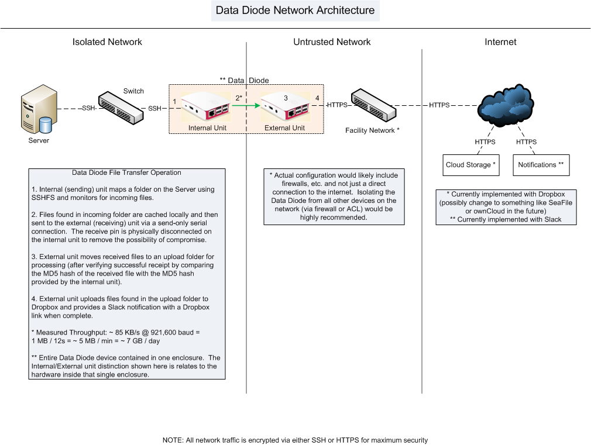
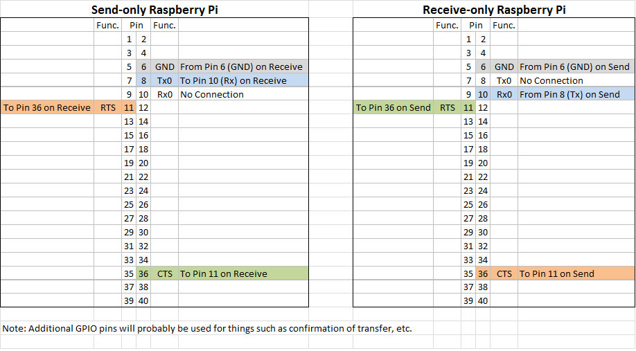
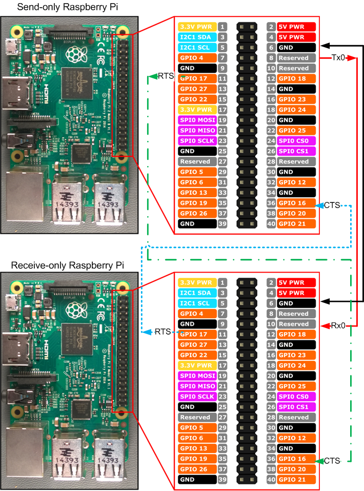

# data-diode
Securely transfer data from a secure network to an public network using Raspberry Pis (effectively a basic unidirectional network device / data diode).

## Secure -> Public transfer between Raspberry Pi units
Each Pi acts as an Ethernet to Serial converter with the 2 Pi units connected via serial port.  Only one of the Tx->Rx pairs is connected so the public side cannot transfer data back to the trusted side.

The serial interface limits throughput, but this design was intended for passing small log/debug files primarily.  Running at a baud rate of 921,600 bps the theoretical max is approximately 110 KB/s.  In testing with the protocol implemented, the Pi could consistently manage approximately 85 KB/s sustained transfer speed (~5 MB/minute).

## Cloud storage / notifications
The upload_data/fileuploader.py script enables uploading files from the public (external network) Pi to a Dropbox folder and sending notifications to a Slack channel when this is done.  

## Remote commands
There is limited support for sending commands to the public Pi via Dropbox (the Pi checks for the presence of a command file).  This enables remotely rebooting or requesting log files.  Using a GPIO pin, a reboot of the secure Pi can also be done.

# Clean install instructions
--------------------------
Write Raspbian Jessie Lite image to disk with Win32DiskImager (Raspbian Jessie Lite - has no GUI)

Install SD card, boot, copy transfer_data/scripts/sys_config.sh script (via SSH/flash drive/etc.)
 - Script is configured to clone the Mercurial repositories from an HTTP server.  Plug in the IP address of your "server" on the "transfer_repo" and "upload_repo" lines.
   - It's very easy to make TortoiseHg run a web server. In TortoiseHg on the menu bar, click Repository->Web Server.  That will open a popup and start it automatically.
     - Clones/Pulls don't require any permission changes
     - To enable pushes back to the HTTP server, you have to adjust the server config slightly.
   - To use Git, some modification of sys_config.sh will be required

NOTE: an internet connection is required for the sys_config script to run because it downloads all the packages it needs to run
 
Run sys_config.sh script ('. sys_config.sh' from the Pi command line)
  - By default, the keyboard is configured as UK English so special characters are different 
  - If you use a special character in the password for the controls user, then change the keyboard layout you will have issues
  - Follow the script prompts to get the keyboard configured correctly and always reboot after changing the keyboard settings

  The script will complete the following actions (most will not require user intervention):
   - Verifies serial port settings / adjusts
   - Checks keyboard settings / prompts for changes if required
   - Removes unnecessary packages
   - Updates its software package list
   - Installs required software (IO/Version Control/Network/Python modules)
   - Creates a controls user account / sets permissions / installs SSH key for login w/out password
   - Clones repositories / creates folders with correct permissions
   - Upgrades OS files (this can take an hour or so)
   - Removes unnecessary files left over from software install / uninstall
   - Installs shortcuts for configuring the Pi with send, receive, or upload functions
   - Install shortcut for automated network security setup (firewall config, SSH hardening)

After script completely done
 - Test controls SSH login (with key)
 - Test controls sudo access (sudo ls /root)
 - Expand the filesystem to use the full SD card (run 'sudo raspi-config' and select 1. Expand File System)
 - Change pi account password (run 'sudo raspi-config' and select 2. Change user password)
 
 Run Network Security script (only do this after verifying the controls user can log in via SSH)
 It does the following:
  - Moves SSH to nonstandard port (Network security script does this)
  - Disables password based logins for SSH
  - Enables firewall (Network security script does this)
  - Optionally disables ping responses

Configure for send or receive / upload via the _Setup scripts in the home folder
  - Sending (Secure Network) Script (~/Sending_Secure_Network_Setup_script)
    - Point SSHFS mount script to correct server (server must be running SSH and have controls user configured for key based login)
  - Receiving (External Network) Script (~/Receiving_External_Network_Setup_script)
  - Uploader (External Network) Script (only run on receiving side) (~/Uploader_External_Network_Setup_script)

# Wiring Details

